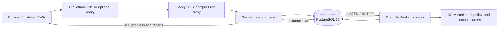

# PodGauge technical specification

> Status: architecture decision and implementation blueprint
>
> Last reviewed: 2026-08-17
>
> Target: `podgauge.com`, self-hosted on Ubuntu behind Caddy

## Executive decision

Build PodGauge as a **TypeScript modular monolith** with two runtime processes and one database:

- a **Svelte 5 / SvelteKit 2** web application running on **Node.js 24 LTS**;
- a separate **Node.js worker** for scans, imports, simulations, and exports;
- **PostgreSQL 18** as the system of record and job-queue backend;
- a custom, installable **progressive web app** built with SvelteKit's service-worker support, Workbox, and IndexedDB;
- **Docker Compose** for repeatable self-hosting, with the existing **Caddy** instance terminating TLS and proxying to a loopback-only app port.

This is deliberately one codebase and one deployable system, not a collection of microservices. The scoring engine, policy rules, schemas, and data ingestion are separate packages with strict boundaries, so they can be tested and versioned independently without creating operational complexity.

The production application stays in the web stack: TypeScript/JavaScript, SQL, HTML, and CSS. Research notebooks may use another language when it materially improves statistical work, but they are optional tooling and can never become a production runtime dependency.

The production application should use current stable releases within the major lines named here. Exact versions belong in the lockfile and container digests. Release candidates, experimental framework features, and floating `latest` container tags do not belong in production.

## Product requirements that drive the architecture

PodGauge must be able to:

1. Accept pasted decklists first, then imports from explicitly supported providers;
2. Validate construction, color identity, legality, release status, and current Commander policy;
3. produce an explainable Deckprint, bracket floor, table-fit recommendation, closing window, volatility, table-impact profile, and confidence;
4. connect every conclusion to card-, relationship-, simulation-, or policy-level evidence;
5. compare revisions and four-deck pods without losing the engine and data versions behind each result;
6. run CPU- and data-heavy work outside the web request path;
7. reproduce a result from immutable inputs, a versioned data snapshot, a policy version, an engine version, and a seed;
8. feel excellent on phones, tablets, and desktops, including installation and useful offline behavior;
9. remain straightforward for one person to develop, secure, back up, and self-host;
10. remain open-source and portable instead of depending on a proprietary cloud platform.

## Recommended stack

| Layer | Choice | Decision rationale |
| --- | --- | --- |
| Language | TypeScript, strict mode | One language across UI, server, worker, schemas, and engine makes refactoring and agent-assisted development safer. |
| Web framework | Svelte 5 + SvelteKit 2 | Small, direct components; SSR, form actions, endpoints, code splitting, accessibility checks, and service-worker support in one framework. |
| Production runtime | Node.js 24 LTS | Current LTS, mature library compatibility, predictable security support, and first-class SvelteKit deployment. Do not deploy on Node's Current line. |
| Build tooling | Vite through SvelteKit | Fast local feedback and the framework's supported build path. |
| Package manager | pnpm workspaces with Corepack | Fast, space-efficient installs and strict dependency boundaries in a monorepo. Pin the pnpm version in `packageManager`. |
| Task orchestration | pnpm workspace scripts initially | Keep the graph visible and simple. Add Turborepo only when CI timings demonstrate a real need for remote or content-addressed caching. |
| Styling | Tailwind CSS 4 + CSS custom-property design tokens | Fast iteration without surrendering control of the design system. Use semantic tokens rather than scattering literal colors. |
| UI primitives | shadcn-svelte + Bits UI, copied selectively | Accessible primitives with local source ownership and no closed visual system. Add only components the product uses. |
| Icons | Lucide Svelte | Coherent, tree-shakeable open-source icon set. |
| Validation/contracts | Zod, JSON Schema, and OpenAPI 3.1 | Runtime validation at every untrusted boundary and a portable public API contract. Generate OpenAPI from shared schemas where practical. |
| Database | PostgreSQL 18, current minor release | Durable relational data, JSONB where justified, full-text/trigram search, transactions, and sufficient headroom without extra services. |
| Database access | Drizzle ORM + reviewed SQL migrations | Strong TypeScript inference while keeping the SQL model visible. Commit generated SQL; never use schema push in production. |
| Authentication | Better Auth with database sessions | Self-hosted TypeScript auth with a supported SvelteKit integration. Start with guest use plus email magic links; offer passkeys as the preferred signed-in method. |
| Background jobs | Graphile Worker | Reliable PostgreSQL-backed jobs, retries, scheduling, and LISTEN/NOTIFY without operating Redis. |
| Live progress | Server-Sent Events | Scan progress is server-to-client. SSE is simpler, reconnectable, and easier to operate than WebSockets for this traffic shape. |
| PWA | SvelteKit service worker + `@vite-pwa/sveltekit` in `injectManifest` mode | Full control over safe caching while automating manifest, asset generation, and Workbox integration. |
| Local/offline data | IndexedDB through Dexie | Durable deck drafts and explicitly offline-enabled reports without storing credentials in browser storage. |
| Unit/integration tests | Vitest + Testing Library + Testcontainers | Fast package tests and real PostgreSQL behavior where mocks would hide failures. |
| Property tests | fast-check | Excellent fit for invariants in parsing, legality, graph construction, scoring, and deterministic simulation. |
| Browser tests | Playwright across Chromium, Firefox, and WebKit | Covers the web app, installability-critical behavior, mobile layouts, and accessibility scans with axe-core. |
| Formatting/linting | Prettier, ESLint, `svelte-check`, and TypeScript | Use the officially supported Svelte toolchain. Treat type and Svelte diagnostics as required checks. |
| Logging/tracing | Pino JSON logs + OpenTelemetry | Structured local logs now, vendor-neutral tracing and metrics when operations warrant it. |
| Deployment | Docker Compose v2 + Caddy 2 | One documented command path, no platform lock-in, automatic HTTPS, and a small operational surface. |
| Supply-chain checks | Renovate, OSV-Scanner, Trivy, Gitleaks, Syft, and Cosign | Automated updates, vulnerability and secret scanning, SBOMs, and signed release images. |

## Why this stack

Svelte compiles declarative components to lean JavaScript, and SvelteKit supplies server rendering, client navigation, build-time rendering, endpoint handling, code splitting, accessibility behavior, and offline support. That combination is a particularly good fit for an information-dense application that must still feel immediate on a phone.

Use stable SvelteKit load functions, form actions, and `+server.ts` endpoints. Do **not** base the core API on SvelteKit remote functions while that feature remains experimental. Public contracts should survive a future framework change.

Node 24 is the correct production target as of this review: Node's own guidance says production applications should run an Active or Maintenance LTS line, and Node 24 is LTS while Node 26 is Current. PostgreSQL 18 is the current supported major and should always be kept at its newest minor release.

PostgreSQL-backed jobs keep the initial topology to three containers—web, worker, and database. PodGauge does not need Redis merely to move scan requests from the web process to a worker. If measured queue pressure eventually justifies a dedicated broker, the job boundary makes that migration possible later.

## System architecture



### Request and analysis flow

1. The web process parses and bounds the request, validates it with a shared schema, authenticates the caller if present, and applies rate limits.
2. In one database transaction it creates an analysis record and enqueues a job. The endpoint returns `202 Accepted` with stable analysis and event URLs.
3. The worker resolves the deck against an explicitly pinned card-data snapshot and policy version.
4. The worker runs the pure engine with an explicit seed, writes structured evidence and the immutable result, and emits progress events.
5. The PWA follows progress through SSE and can reconnect using the last event identifier.
6. Equivalent requests may reuse a completed result only when the normalized deck hash, options, engine version, policy version, card snapshot, and seed all match.

## Repository layout

```text
apps/
  web/                 SvelteKit UI, server routes, REST API, and SSE
  worker/              Graphile Worker tasks and scheduled imports
packages/
  engine/              Pure deterministic scoring and simulation
  policy/              Versioned Commander policy and bracket rules
  card-data/           Normalization, role overlays, and source adapters
  contracts/           Zod schemas, API types, and report schema
  db/                  Drizzle schema, repositories, and migrations
  ui/                  PodGauge-owned components and design tokens
  observability/       Logging, tracing, metrics, and redaction helpers
analysis/              Optional research notebooks; never a production dependency
benchmarks/            Calibration corpus manifests and evaluation code
data/fixtures/         Gold-standard and adversarial test decks
docs/                  Product, method, operations, and architecture docs
infra/
  compose/             Self-hosted Compose definitions and examples
  caddy/               Example Caddy configuration
  scripts/             Backup, restore, health, and deployment helpers
```

Use package export maps and dependency rules. `engine` may depend on contracts and explicit data interfaces; it must not import SvelteKit, Drizzle, network clients, environment variables, clocks, or global randomness.

## Application boundaries

### Web application

The SvelteKit app owns:

- public pages and documentation;
- deck entry, revision comparison, report, and Pod Fit interfaces;
- authentication and account settings;
- stable REST endpoints under `/api/v1`;
- progressive-enhancement form actions for same-origin HTML workflows;
- authorization, request validation, and rate limiting;
- SSE endpoints for analysis progress;
- share links and privacy controls.

Prefer server rendering for the first useful view and hydrate only interactive regions. The app must remain navigable and deck submission must remain usable when JavaScript fails; PWA enhancements layer on top.

### Deterministic engine

The engine is a pure library with serializable inputs and outputs. Its API should resemble:

```ts
type AnalyzeDeck = (
  input: NormalizedDeck,
  context: {
    engineVersion: string;
    policyVersion: string;
    cardDataSnapshotId: string;
    benchmarkVersion: string;
    seed: string;
  },
) => AnalysisReport;
```

Engine requirements:

- no network, database, filesystem, wall-clock, locale, or environment access;
- no `Math.random()`; use a small versioned PRNG with published test vectors;
- explicit, stable sorting before graph traversal or result serialization;
- integer or fixed-point counters for score-critical aggregation, with rounding only at presentation boundaries;
- reason codes and evidence references instead of UI prose in core output;
- golden fixtures for every bracket rule, known combo class, and scoring boundary;
- property tests for invariants such as order independence, legal duplicate handling, seed repeatability, and bounded outputs;
- snapshot-schema versioning independent from UI releases.

Natural-language explanations may be generated from the structured report, but they cannot add findings, alter scores, or replace evidence. Any optional LLM integration must be disabled by default for self-hosters and must display its provider and data-sharing implications.

### Worker

The worker owns all tasks that are slow, retryable, scheduled, or resource-intensive:

- deck normalization and analysis;
- seeded simulations;
- card and policy snapshot ingestion;
- Commander Spellbook synchronization;
- benchmark evaluation;
- report and share-image export;
- cleanup under explicit retention rules.

Validate every job payload at runtime even though it originated from TypeScript. Jobs can outlive the code version that created them. Give every task an idempotency key and make writes safe to retry. Begin with one job per worker process for CPU-heavy analysis; scale worker replicas before adding in-process concurrency.

### API contract

Use boring, durable HTTP semantics:

```text
POST /api/v1/analyses
GET  /api/v1/analyses/{id}
GET  /api/v1/analyses/{id}/events
POST /api/v1/pods
GET  /api/v1/pods/{id}
GET  /api/v1/versions
```

- Commit a generated OpenAPI 3.1 document.
- Use `Idempotency-Key` for analysis and import creation.
- Return RFC 9457 problem details for API errors.
- Cursor-paginate collections; do not expose unbounded result sets.
- Include engine, policy, card-data, benchmark, and report-schema versions in every analysis response.
- Use strong ETags for immutable public reports and `Cache-Control: private, no-store` for private or session-specific responses.
- Keep browser and public API origins the same initially. Do not enable broad CORS.

## Data design

PostgreSQL is authoritative. Use normalized relational columns for identifiers, ownership, state, visibility, and joins; use JSONB for immutable versioned engine documents that are validated by the application schema.

Core entities:

- `users`, `sessions`, `accounts`, and `passkeys`;
- `decks` and immutable `deck_revisions`;
- `card_data_snapshots`, `cards`, `printings`, and `card_role_overlays`;
- `policy_versions`, `policy_rules`, and `game_changer_snapshots`;
- `engine_versions` and `benchmark_versions`;
- `analyses`, `analysis_events`, `analysis_findings`, and `analysis_artifacts`;
- `pods`, `pod_members`, and `pod_comparisons`;
- `source_sync_runs` and provenance records;
- `audit_events` for security-sensitive changes.

Rules:

- Deck revisions and completed reports are immutable. Editing creates a new revision.
- A report points to exact immutable version records, never a mutable `current` row.
- New source data is staged, validated, and atomically promoted. Retain the previous known-good snapshot for rollback and reproducibility.
- Store canonical external identifiers and source provenance. Do not use card names as durable keys.
- Keep third-party raw data only as allowed by its current terms. Do not mirror card images or datasets merely for convenience.
- Use separate PostgreSQL roles for migrations, web, worker, and backup. Runtime roles receive no DDL privilege.
- Add row-level security as defense in depth before private deck sharing reaches general availability; application authorization remains mandatory.
- Generate reviewed SQL migrations in development and run them as an explicit, one-shot deployment step.

PostgreSQL full-text search and `pg_trgm` are enough for the first several product stages. Do not add Elasticsearch, Meilisearch, or a vector database until a measured query or product requirement calls for one.

## PWA specification

The PWA is a product capability, not a manifest added at the end.

### Installability

Ship a valid web app manifest with:

- `name`, `short_name`, `description`, `start_url`, `scope`, `id`, and `lang`;
- `display: "standalone"` and a conservative `display_override` fallback chain;
- 192px and 512px icons, including `maskable` variants;
- coherent `theme_color` and `background_color` for light and dark modes;
- screenshots for richer install UI where supported;
- shortcuts for **Scan a deck**, **My decks**, and **Pod Fit**;
- share-target and `.txt`/`.dek` file-handler support only as progressive enhancements after the core flows are stable.

Installation requires HTTPS in production, which Caddy provides. Show an install affordance after a user receives value—such as after their first report—not as an interrupt on first visit. Include platform-specific manual instructions for iOS where browser prompting differs.

### Offline behavior

Use a custom service worker in `injectManifest` mode. The caching contract is:

| Resource | Strategy | Limit |
| --- | --- | --- |
| Hashed application JS/CSS/fonts/icons | Precache, cache-first | Current and immediately previous build |
| Public shell/navigation | Network-first with offline fallback | Small bounded cache |
| Public immutable report by versioned URL | Stale-while-revalidate | LRU by count and age |
| Card images | Cache-first after use | Strict LRU byte/count cap; never precache the card catalog |
| Auth, account, admin, private API, mutations | Network only | Never stored by the service worker |

The service worker must honor `Cache-Control: no-store`, exclude `/api/auth/**`, and never cache responses containing session-specific data. Cache names include the app build version. Present a user-controlled **Update available** action instead of forcing activation while a deck edit is open.

IndexedDB stores:

- local deck drafts;
- a bounded list of recent public reports;
- private reports only after explicit **Available offline on this device** consent;
- an outbox of deck submissions awaiting connectivity.

Never store session identifiers, auth tokens, password material, secrets, or privileged API responses in IndexedDB, `localStorage`, or the Cache API. The app must verify authorization with the server after reconnecting; possession of cached data is not authorization.

Signing out must purge the current user's private offline reports and outbox. Provide an obvious storage screen that shows locally retained data and can erase it completely.

Full scoring is server-side initially. Offline users can edit and validate decklist syntax, see the last safely cached report, and queue a scan, but the UI must not imply that a queued scan has run.

### Native-feeling interaction

- Mobile-first layouts with safe-area insets and at least 44-by-44 CSS-pixel touch targets.
- Persistent, URL-addressable state for filters and report sections.
- Optimistic UI only where reversal is safe; analysis status always comes from durable server state.
- Skeletons for initial fetches, explicit progress stages for scans, and calm offline/reconnect states.
- Keyboard-complete operation, visible focus, reduced-motion support, semantic HTML, and WCAG 2.2 AA as the acceptance target.
- Dark and light themes driven by design tokens and the OS preference, with a persisted user override.
- Web Share and clipboard support where available, always backed by ordinary links and buttons.
- Push notifications only as a later opt-in for genuinely long scans; never request notification permission on first load.

## Security baseline

Use OWASP ASVS 5.0 Level 2 as the release baseline and threat-model high-risk flows before implementation. The most important PodGauge-specific controls are below.

### Authentication and authorization

- Anonymous scans are allowed only behind strict IP and workload quotas.
- Use opaque, database-backed sessions in `Secure`, `HttpOnly`, host-only cookies with an appropriate `SameSite` policy; never place bearer tokens in browser storage.
- Keep SvelteKit origin checks enabled and require CSRF protection for all state-changing cookie-authenticated requests.
- Prefer passkeys; use verified email magic links for onboarding and recovery. Require stronger reauthentication for account deletion, email changes, and admin actions.
- Authorize every object read and mutation by owner and visibility. Unpredictable identifiers do not replace authorization.
- Public sharing is an explicit state change. New decks and reports are private by default.
- Record security-sensitive actions with actor, object, outcome, request ID, and timestamp, without recording deck contents or secrets unnecessarily.

### Input, imports, and computation

- Validate type, length, range, and format at the HTTP boundary, job boundary, and source-ingestion boundary.
- Put tight body, deck-size, URL, redirect, response-size, decompression, and processing-time limits on imports.
- Never offer a generic server-side “fetch this URL” feature. Implement one adapter per allowlisted deck provider.
- Treat imports as an SSRF boundary: resolve and re-check every redirect, reject non-HTTPS destinations, block credentials in URLs, and block loopback, private, link-local, multicast, and cloud-metadata address ranges for both IPv4 and IPv6.
- Parse remote content as data. Do not execute scripts, follow embedded resources, or render unsanitized HTML/Markdown.
- Bound simulations by iterations, CPU time, memory, and concurrent jobs. Rate-limit by account and trusted client address, with tighter anonymous limits.
- Use parameterized database queries. Never assemble SQL, shell commands, or source queries from user-controlled strings.

### Browser security

- Configure SvelteKit's CSP in nonce/hash `auto` mode. Begin with `default-src 'none'` and explicitly permit only required same-origin resources and approved card-image hosts.
- Prefer class-based CSS animation over Svelte transitions that would force `style-src 'unsafe-inline'`; any CSP relaxation requires an explicit security review.
- Avoid `{@html}`. If a reviewed feature truly requires HTML, sanitize it with an allowlist and test adversarial payloads.
- Set `frame-ancestors 'none'`, `base-uri 'none'`, `object-src 'none'`, and a narrow `form-action`.
- Add `X-Content-Type-Options: nosniff`, `Referrer-Policy: strict-origin-when-cross-origin`, and a minimal `Permissions-Policy`.
- Introduce HSTS after HTTPS is confirmed across every covered subdomain. Do not preload it casually.
- Keep production source maps private unless a self-hosted error service requires them.

### Secrets and dependencies

- Keep secrets out of Git, images, logs, client bundles, and command-line arguments. Mount them as Compose secrets or root-owned files and load them only in the process that needs them.
- Commit the pnpm lockfile and install with `--frozen-lockfile` in CI.
- Pin base images by supported release and digest, update them through Renovate, and never deploy floating tags.
- Run containers as non-root with a read-only filesystem where possible, `no-new-privileges`, all Linux capabilities dropped, explicit writable mounts, and resource limits.
- Scan commits for secrets, dependencies with OSV, and container images with Trivy. Produce an SBOM and sign release images.
- Maintain a `SECURITY.md` with a private reporting route and supported-version policy before public launch.

## Deployment on Ubuntu with Caddy

### Production topology

```text
Internet
  -> Cloudflare DNS (optionally proxied)
  -> Ubuntu firewall: 80/443 only to Caddy
  -> Caddy on the host
  -> 127.0.0.1:3000 -> web container

Private Compose network
  -> web container
  -> worker container
  -> PostgreSQL container
```

PostgreSQL and the worker publish no host ports. The web container publishes only to `127.0.0.1`. Administrative access should use SSH keys through a restricted source network or a private overlay such as Tailscale; do not expose database or container-management ports.

The SvelteKit production build uses `@sveltejs/adapter-node`. Set:

```dotenv
NODE_ENV=production
ORIGIN=https://podgauge.com
HOST=0.0.0.0
PORT=3000
BODY_SIZE_LIMIT=256K
SHUTDOWN_TIMEOUT=30
```

Set proxy-address variables only for the verified proxy topology. Forwarded headers are attacker-controlled unless the app can only be reached through the trusted proxies.

An initial host Caddyfile can remain small:

```caddyfile
podgauge.com {
    encode zstd gzip

    header {
        X-Content-Type-Options nosniff
        Referrer-Policy strict-origin-when-cross-origin
        Permissions-Policy "camera=(), microphone=(), geolocation=()"
        -Server
    }

    reverse_proxy 127.0.0.1:3000
}

www.podgauge.com {
    redir https://podgauge.com{uri} permanent
}
```

Generate the CSP in SvelteKit, where per-response nonces are available, rather than hard-coding it in Caddy. Caddy automatically obtains and renews certificates and redirects HTTP to HTTPS when DNS and ports are correct.

### Cloudflare modes

Choose and document one mode:

1. **DNS only:** simplest and most independent. Caddy receives the client connection directly. The trusted proxy depth between SvelteKit and the internet is one: Caddy.
2. **Cloudflare proxied:** use **Full (strict)** TLS, never Flexible. Restrict origin ports 80/443 to Cloudflare's published networks or authenticate the proxy-to-origin path. Only then trust `CF-Connecting-IP` or a two-proxy `X-Forwarded-For` chain. Automate Cloudflare IP-range updates and test the failure mode before enabling the restriction.

Cloudflare is optional infrastructure, not an application dependency. The app must continue to work when the record is switched to DNS-only.

For DNS-only mode, configure SvelteKit with `ADDRESS_HEADER=X-Forwarded-For` and `XFF_DEPTH=1`. For Cloudflare-proxied mode with origin access restricted to Cloudflare, prefer `ADDRESS_HEADER=CF-Connecting-IP`. Do not set either profile until its network restriction is in place and tested. Disable Rocket Loader and do not apply blanket Cloudflare HTML caching to authenticated application routes.

### Images and releases

- Build multi-stage, multi-architecture OCI images from `node:24-bookworm-slim` or another supported glibc-based image.
- Run as an unprivileged UID and include a health check.
- Publish immutable semantic-version and commit-SHA tags to an OCI registry; provide a local-build Compose path as a fallback.
- Run database migrations once before the new web and worker versions accept traffic. Never let every replica race to migrate.
- Expose `/health/live` for process health and `/health/ready` for database and required-snapshot readiness. Keep health responses non-sensitive.
- Handle `SIGTERM` and drain web requests and worker jobs cleanly.

### Backups and recovery

The data is not backed up merely because it is in a Docker volume.

- Start with nightly encrypted PostgreSQL logical backups plus the Compose configuration, migration history, and required secret inventory.
- Copy backups off the server with restic to a separately credentialed destination.
- Retain daily, weekly, and monthly generations under a documented policy.
- Add WAL archiving and pgBackRest when the recovery-point objective becomes shorter than one day.
- Run and record an automated restore test at least monthly.
- Card-data snapshots that can be re-fetched do not replace backups of user decks, classifications, policies, and reports.

## Observability and operations

- Emit one-line JSON logs to stdout with request, analysis, job, engine, and snapshot identifiers.
- Redact cookies, authorization values, email addresses where unnecessary, imported URLs with credentials, deck contents, and secrets.
- Propagate a request ID from Caddy or create one at the edge; carry it into jobs and reports.
- Start with health checks, structured logs, queue depth, job latency, job failure rate, HTTP latency/error rate, database saturation, and disk/backup age.
- Add OpenTelemetry tracing before introducing a vendor dashboard. Instrument stable application and database boundaries first; use SvelteKit's built-in span emission only after that framework feature is stable. Export to an optional self-hosted collector.
- Alert on sustained error rate, a stuck queue, failed source synchronization, low disk space, certificate problems, and stale or failed backups.
- Self-hosted installs send no telemetry by default. Any future project telemetry must be explicit, documented, minimal, and disableable.

## Test and quality strategy

### Required test layers

1. **Engine unit tests:** every scoring rule and reason code.
2. **Golden fixtures:** known decks, policy boundaries, combos, adversarial graphs, and exact deterministic output.
3. **Property tests:** parser and engine invariants across generated inputs.
4. **Database integration tests:** migrations, constraints, authorization queries, idempotent jobs, and rollback behavior against real PostgreSQL.
5. **Contract tests:** generated OpenAPI, request validation, and backwards-compatible report schemas.
6. **Browser tests:** guest scan, signed-in deck lifecycle, offline draft, reconnect, install manifest, update prompt, Pod Fit, sharing privacy, and account security.
7. **Accessibility tests:** axe-core in Playwright plus manual keyboard, screen-reader, contrast, zoom, and reduced-motion review.
8. **Security tests:** SSRF adapters, stored XSS payloads, CSRF, object authorization, rate limits, oversized bodies, decompression bombs, and job exhaustion.
9. **Calibration tests:** benchmark metrics, regressions by archetype/bracket, and before/after result diffs for every engine change.

### Merge gates

Every pull request should run:

```text
format check
lint
svelte-check
TypeScript check
unit and property tests
database integration tests
production build
targeted Playwright smoke tests
dependency and secret scans
```

Full cross-browser, accessibility, container, restore, and benchmark suites may run on the main branch or release candidate if their runtime is too high for every change. Score-affecting changes cannot merge without fixture and benchmark evidence.

## Developer experience

The local path should be memorable:

```text
corepack enable
pnpm install
docker compose up -d postgres
pnpm db:migrate
pnpm dev
```

Provide root scripts for `dev`, `check`, `test`, `test:e2e`, `build`, `db:generate`, `db:migrate`, `db:seed`, `data:sync`, and `benchmark`. A new contributor should not need globally installed JavaScript tools other than the pinned Node/Corepack path and Docker.

Keep configuration in a validated, typed server-only module that fails fast with actionable messages. Supply `.env.example` with safe placeholders. Seed development with a tiny legal fixture dataset; make the full card-data import a separate command.

Agent-assisted or “vibe” coding should still pass through the same contracts:

- small packages with obvious ownership;
- shared runtime schemas rather than duplicated interfaces;
- short feedback loops and single-purpose commands;
- fixtures that make behavioral intent executable;
- architecture decision records for changes to foundational choices;
- no generated code accepted without tests, types, and a human-readable diff.

## Performance and scaling path

Design for a fast single server first:

- cache immutable public reports at Caddy and the browser with content-aware headers;
- add database indexes from measured queries, not guesses;
- keep Scryfall normalization and analysis off the request path;
- memoize only against the full version tuple;
- stream progress rather than holding HTTP requests open until completion;
- use worker replicas and Graphile concurrency controls before introducing another queue service;
- partition or archive analysis events only after table size and query plans justify it;
- move large immutable artifacts to S3-compatible object storage only when PostgreSQL size or backup time demonstrates the need;
- use Node worker threads for simulation only after profiling shows a useful speedup.

A larger installation can independently scale stateless web containers and worker containers against PostgreSQL. The package boundaries also allow a future engine implementation in Rust/Wasm if profiling proves TypeScript insufficient, without changing the report contract or product architecture. That is an optimization path, not an initial dependency.

## Implementation sequence

### Foundation

- Create the pnpm workspace and package boundaries.
- Scaffold SvelteKit with strict TypeScript, Tailwind, linting, formatting, Vitest, and Playwright.
- Add PostgreSQL, Drizzle migrations, Graphile Worker, typed configuration, and Compose.
- Establish report, deck, policy, and snapshot schemas before UI depth.
- Add Caddy and backup examples plus health endpoints.

### Trustworthy scanner

- Paste-only deck ingestion and canonical normalization.
- Construction, legality, color identity, release, banned-card, Game Changer, and bracket-floor fixtures.
- Immutable reports with exact version tuple and evidence expansion.
- Guest quotas, private-by-default accounts, passkeys/magic links, and explicit sharing.

### PWA and analysis depth

- Install manifest, app icons, safe service-worker caching, offline drafts, and update UX.
- Seeded mana/castability simulations and closing windows.
- Revision comparison, exports, feedback tied to exact report versions, and Pod Fit.

### Calibration and operations

- Benchmark dashboards and published methodology releases.
- Opt-in post-game logging and permitted integrations.
- Restore drills, security review against ASVS, load tests, and release-image signing.

## Explicit non-choices

- **No Next.js/React requirement:** its ecosystem is excellent, but PodGauge gains more from Svelte's smaller component surface and direct PWA ergonomics than from React's scale of third-party packages.
- **No Bun production runtime initially:** use it only for experiments until the chosen auth, database, worker, observability, and test stack is proven under PodGauge's workload. Node LTS is the boring security choice.
- **No SQLite in production:** PostgreSQL better fits concurrent workers, multi-user history, search, and durable job semantics while remaining easy to Compose.
- **No Redis initially:** it adds a service without adding a required capability.
- **No GraphQL or tRPC initially:** REST plus OpenAPI is easier to cache, document, integrate, and keep independent from the UI framework.
- **No generic URL importer:** provider adapters are a deliberate SSRF defense and a data-quality boundary.
- **No Kubernetes:** Compose and Caddy are the right scale for a single Ubuntu host. Revisit only for an actual multi-node requirement.
- **No LLM-owned scoring:** language models may assist classification review or explanation, but the score and evidence path remain deterministic and inspectable.
- **No premature native wrapper:** ship a first-class PWA before considering Tauri or Capacitor. A wrapper is justified only by a proven capability the web platform cannot provide.

## Licensing recommendation

The repository currently grants no license because it has no `LICENSE` file. Before accepting external contributions, choose deliberately:

- **AGPL-3.0-or-later** if hosted modifications should remain available to their users;
- **Apache-2.0** if maximum adoption and explicit patent terms matter more than network copyleft.

Keep third-party card data, card images, benchmark submissions, project source, and documentation under clearly separated terms. The software license cannot grant rights to Wizards of the Coast material or third-party datasets.

## Research basis

This decision was checked against current primary documentation on 2026-08-17:

- [Svelte and SvelteKit overview](https://svelte.dev/docs/kit/introduction), including SSR, code splitting, offline support, and Vite-based development.
- [SvelteKit Node deployment](https://svelte.dev/docs/kit/adapter-node), including proxy trust, body limits, and graceful shutdown.
- [SvelteKit service workers](https://svelte.dev/docs/kit/service-workers) and [SvelteKit CSP/CSRF configuration](https://svelte.dev/docs/kit/configuration#csp).
- [Node.js release policy](https://nodejs.org/en/about/previous-releases), which identifies Node 24 as LTS at the review date and recommends LTS for production.
- [PostgreSQL versioning policy](https://www.postgresql.org/support/versioning/), including current supported majors and the recommendation to run the current minor release.
- [Drizzle migration guidance](https://orm.drizzle.team/docs/migrations), especially generated, reviewable SQL migrations.
- [Better Auth's SvelteKit integration](https://better-auth.com/docs/integrations/svelte-kit) and [passkey support](https://better-auth.com/docs/plugins/passkey).
- [Graphile Worker](https://worker.graphile.org/), a PostgreSQL-backed Node job queue with retries, scheduling, and LISTEN/NOTIFY.
- [PWA installability requirements](https://developer.mozilla.org/en-US/docs/Web/Progressive_web_apps/Guides/Making_PWAs_installable) and [offline/service-worker guidance](https://web.dev/learn/pwa/service-workers).
- [Caddy automatic HTTPS](https://caddyserver.com/docs/automatic-https) and [reverse proxy documentation](https://caddyserver.com/docs/caddyfile/directives/reverse_proxy).
- [Cloudflare Full (strict) TLS](https://developers.cloudflare.com/ssl/origin-configuration/ssl-modes/full-strict/) and [origin IP allowlisting](https://developers.cloudflare.com/fundamentals/concepts/cloudflare-ip-addresses/).
- [Docker Compose secrets](https://docs.docker.com/compose/how-tos/use-secrets/).
- [OWASP ASVS](https://owasp.org/www-project-application-security-verification-standard/), [strict CSP guidance](https://cheatsheetseries.owasp.org/cheatsheets/Content_Security_Policy_Cheat_Sheet.html), [REST security](https://cheatsheetseries.owasp.org/cheatsheets/REST_Security_Cheat_Sheet.html), and [session management](https://cheatsheetseries.owasp.org/cheatsheets/Session_Management_Cheat_Sheet.html).
- [Playwright accessibility testing](https://playwright.dev/docs/accessibility-testing) with axe-core and cross-browser automation.

Re-evaluate foundational versions before the initial scaffold and at least annually. Change the architecture only when a concrete product, security, compatibility, or operational requirement outweighs the cost of migration.
